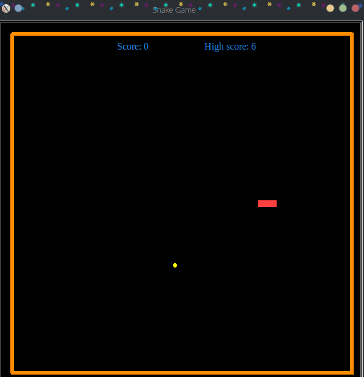

# Snake_Game
:::::: {.cols data-latex=""}

::: {.col data-latex="{0.55\textwidth}"}
    
    
:::

::: {.col data-latex="{0.05\textwidth}"}
\ 
<!-- column separator -->
:::

::: {.col data-latex="{0.4\textwidth}"}

Snake Game with python's module turtle
 After running main.py

<ul>
    <li>To start or restart game press **space** keypad</li> 
    <li>To move the snake Up, press **Up** keypad</li> 
    <li>To move the snake Down, press **Down** keypad</li> 
    <li>To move the snake Left, press **Left** keypad</li> 
    <li>To move the snake Right, press **Right** keypad</li> 
</ul>

